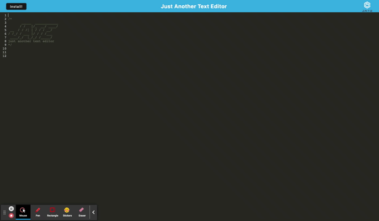

# Text Editor

## Description 
A text editor with progressive web application functionality. Data persistence using IndexedDB and localStorage.

## Table of Contents

* [Installation](#installation)
* [Usage](#usage)
* [License](#license)

## Installation

This application is deployed live on heroku, therefore  all that is needed to interact wiht it is a browser and, initially, an internet connection.

## Usage 

Application can be run in the browser or installed to your local machine. It will function without internet connection.

 
 

## License

This project is licensed under MIT.

## Questions

If you have any questions about this project, please contact me at burningcupidxxx@gmail.com. 
 

More projects can be viewed at https://github.com/scottybuoy